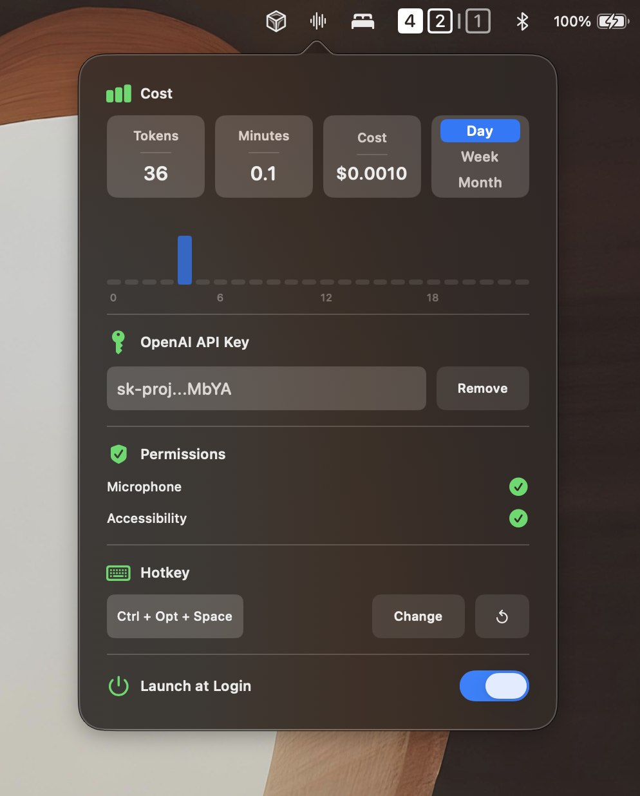
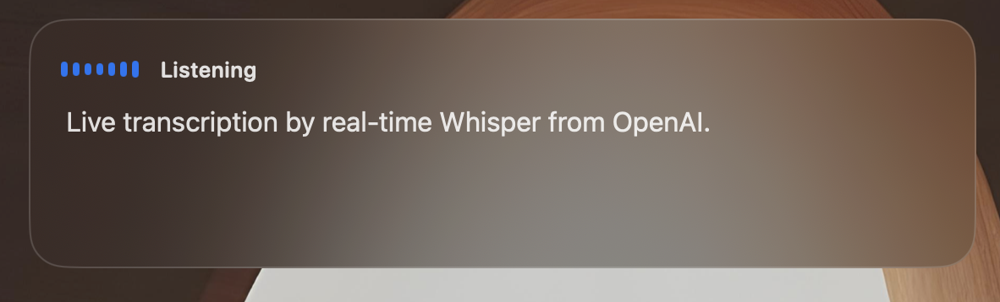

# WhisperBar

WhisperBar is a small native macOS menu bar dictation app. Press a global hotkey, speak, watch a floating transcript pill, then let the app paste the final transcript into the currently focused field.

It talks directly to the OpenAI API from your Mac. There is no backend, account sync, model picker, endpoint picker, or developer settings surface.

## Install

Download the latest `WhisperBar-<version>-unsigned.dmg` from [Releases](https://github.com/Val4evr/whisperbar/releases). No Xcode required.

1. Open `WhisperBar-<version>-unsigned.dmg`.
2. Drag `WhisperBar.app` into `Applications`.
3. Eject the DMG.
4. Open `/Applications/WhisperBar.app`. If macOS blocks it, Control-click the app, choose **Open**, then confirm.
5. If macOS still blocks it, open **System Settings -> Privacy & Security**, scroll to the security warning, click **Open Anyway**, then confirm.
6. Add your own OpenAI API key in WhisperBar.
7. Choose a hotkey.
8. Grant Microphone and Accessibility permissions to `/Applications/WhisperBar.app`.

> [!WARNING]
> After first launch, check **System Settings -> Privacy & Security** even if the app appears to open normally. WhisperBar needs Microphone permission for dictation and Accessibility permission for automatic paste. If either is missing, recording, hotkeys, or paste may look broken. Grant permissions only to `/Applications/WhisperBar.app`.

> [!NOTE]
> WhisperBar is menu-bar-only and will not appear in the Dock.

Building from source is documented separately in [INSTALL_FROM_SOURCE.md](INSTALL_FROM_SOURCE.md).

## Features

- Streams microphone audio to OpenAI Realtime transcription with `gpt-realtime-whisper`.
- Shows a floating, draggable, non-activating dictation pill while recording/finalizing.
- Displays live transcript deltas while speaking.
- Uses final completed transcript events for pasted text when available.
- Pastes into the currently focused app with a synthetic `Cmd+V`.
- Preserves clipboard history by restoring the previous clipboard after paste.
- Stores the OpenAI API key locally in a user-only app support file.
- Tracks local usage by dictation duration and estimates cost for day/week/month.
- Supports launch at login.

## Notes

Fresh installs start with no hotkey configured. Use `Change` to record one, or press the reset button to fill in the suggested `Control + Option + Space` shortcut.

OpenAI bills `gpt-realtime-whisper` by audio duration. WhisperBar estimates local cost at `$0.017/minute`, about `$1.02/hour`; this is not a billing API integration.

## License

WhisperBar is released under the [MIT License](LICENSE).
